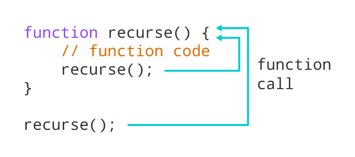
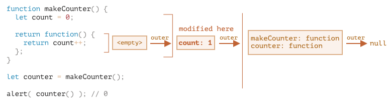

# Рекурсия и Замыкания в JavaScript

## Введение
Рекурсия и замыкания - это два мощных концепта в программировании, которые широко используются в решении задач разного уровня сложности. В этом файле мы разберем основы этих понятий с примерами.

---

## Рекурсия
Рекурсия - это процесс, при котором функция вызывает саму себя. Это полезно для решения задач, которые можно разбить на подзадачи того же типа.

### Пример: Факториал числа
Факториал числа \( n \) вычисляется как произведение всех натуральных чисел от 1 до \( n \). Формула: \( n! = n \times (n-1)! \).

### Код:
```javascript
function factorial(n) {
  if (n === 0) {
    return 1; // Базовый случай
  } else {
    return n * factorial(n - 1); // Рекурсивный случай
  }
}

console.log(factorial(5)); // Вывод: 120
```

### Иллюстрация процесса


---

## Замыкания
Замыкание - это функция, которая «помнит» свое лексическое окружение, даже если она вызывается вне этого окружения.

### Пример: Счетчик
Создадим функцию-счетчик, которая увеличивает значение при каждом вызове.

### Код:
```javascript
function createCounter() {
  let count = 0; // Переменная из замыкания

  return function () {
    count++;
    return count;
  };
}

const counter = createCounter();

console.log(counter()); // Вывод: 1
console.log(counter()); // Вывод: 2
console.log(counter()); // Вывод: 3
```

### Как это работает
- Внутренняя функция имеет доступ к переменной `count`, даже после завершения работы внешней функции `createCounter`.

### Схема замыкания

---

## Когда использовать?
### Рекурсия
- Задачи с иерархической структурой (например, обход дерева).
- Решение математических задач (например, вычисление факториала или чисел Фибоначчи).

### Замыкания
- Реализация инкапсуляции.
- Создание функций с частично фиксированными аргументами (частичное применение).
- Обработка асинхронных задач.

---

## Дополнительные ресурсы
- [MDN: Рекурсия](https://developer.mozilla.org/ru/docs/Glossary/Recursion)
- [MDN: Замыкания](https://developer.mozilla.org/ru/docs/Web/JavaScript/Closures)

---

Надеемся, что этот материал поможет вам лучше понять рекурсию и замыкания. Если у вас есть вопросы, не стесняйтесь их задавать!
